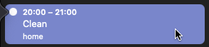

# Fantastical Alfred Workflow

Add new events to Fantastical with Alfred.

## Setup

Install the automation and change the following settings (if desired):

* **Notifications**
  Toggle notifications on or off with the checkbox

  
  *Example:*

  
* **Keyword**
  Change the default keyword from `cal` to your own custom one

  

## Usage

Interact with Fantastical via the `cal` keyword. (or your own if changed in settings)

After pressing Enter the event is added to Fantastical

